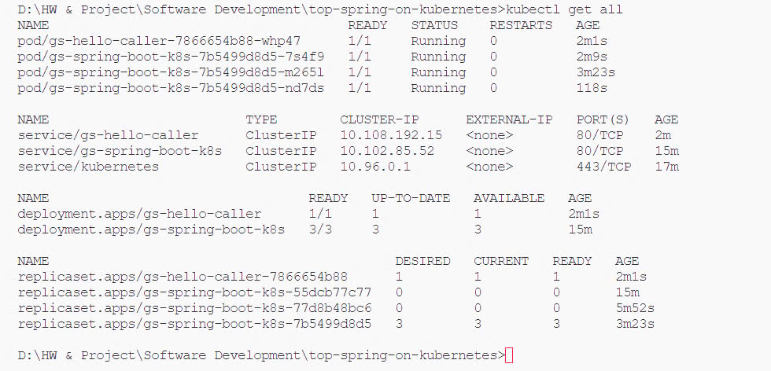

## Deploy with Docker

## K8S 

### Build Docker image

'''
mvn spring-boot:build-image -Dspring-boot.build-image.imageName=spring-k8s/hello-spring-k8s
mvn spring-boot:build-image -Dspring-boot.build-image.imageName=spring-k8s/hello-caller
'''

### Deploy 

#### Basic deployment

'''
cd ".\k8s-artifacts\basic"

kubectl apply -f deployment.yaml
kubectl apply -f service.yaml
'''

#### Config map
'''
cd ".\k8s-artifacts\config_map"
kubectl create configmap gs-spring-boot-k8s --from-file=application.properties
'''

#### Service Discovery and Load Balancing (Deploy both services)

'''
kubectl apply -f deployment.yaml
kubectl apply -f service.yaml

kubectl apply -f caller_deployment.yaml
kubectl apply -f caller_service.yaml
'''

